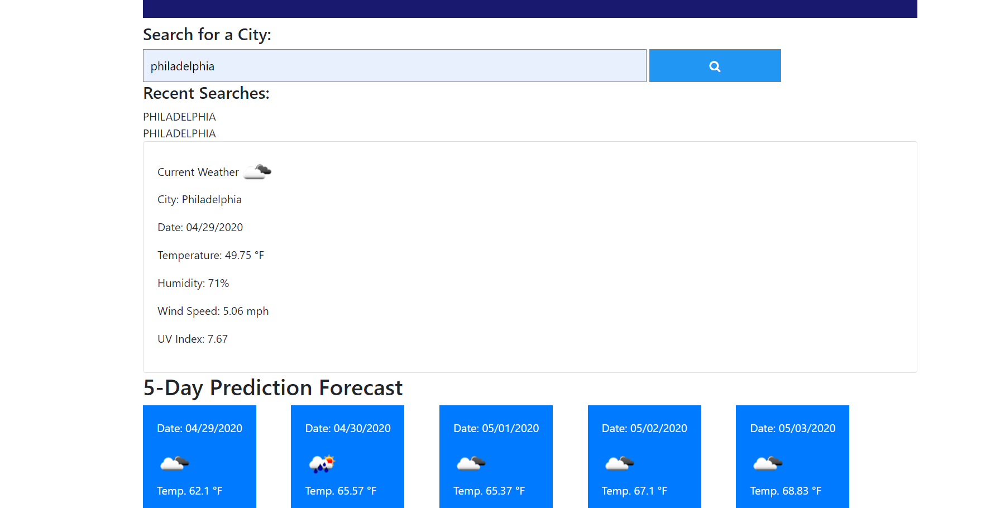

# Weather Dashboard  

 

## Functionality
According to the National Science Foundation, Weather controls the distribution of rain water on earth. All living organisms on earth require liquid water to survive, and humans require fresh water for drinking and agriculture. Droughts can have a major impact on humans and have killed millions of people throughout history.
This app presents a 5 day weather forecast to prepare for the upcoming days. 

 #### GitHub Repository

## How it works
Insert city of choice location into search tab. With this information, Weather for that specific city will present you with the exact forecast for the day, within 5-days. 
Plan accordingly!

 

 

 
 

 

